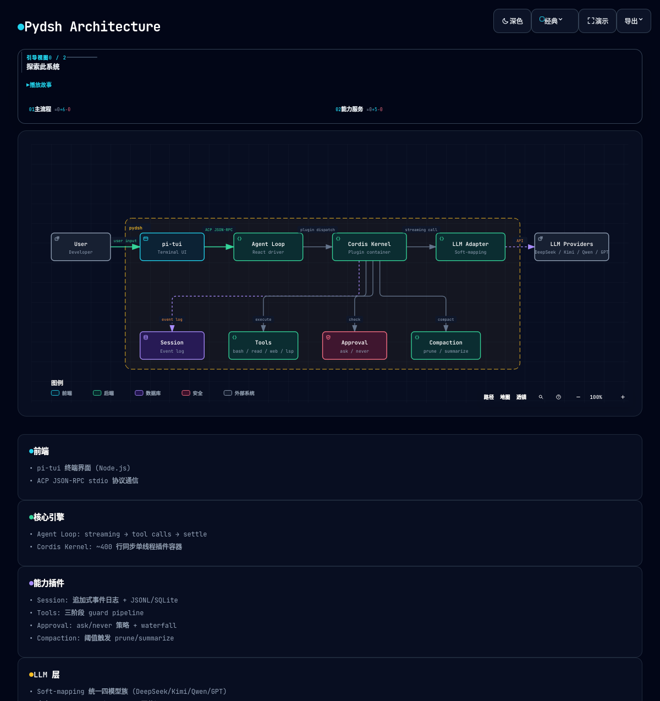

# pydsh

[English](README.md) | 中文

**最小的 DeepSeek Harness，用 Python 写就。** 插件循环、hooks、权限、目标/计划——一条命令，零配置。从零构建的 dsh 工程骨架教学复刻。

> DeepSeek Harness（dsh）是一个 AI agent 框架。这是它的 Python 镜像——同样架构，最小化裁剪，开箱即用。[deepseek-harness-anatomy](https://github.com/ChenYu1991ppak/deepseek-harness-anatomy) 是配套教程，逐机制解释一切。



## 谁该用这个

- **你想找一个现在就能用的 Python agent harness**——clone、配 API key、`make tui`，你就有了一日一用的编程 agent，附带工具、技能、子代理和上下文压缩
- **你在研究 agent 架构**——每个机制都对齐官方 dsh 源码（`↔ packages/*/src`），教学简化处明确标注
- **你在构建自己的 agent 框架**——fork 即可当模板；Cordis 插件容器、seam 三角色模式、事件流持久化全部可复用
- **你读了配套教程** [deepseek-harness-anatomy](https://github.com/ChenYu1991ppak/deepseek-harness-anatomy)，想看看真东西在 Python 里长什么样

## 项目描述

pydsh 是官方 [DeepSeek Harness](https://github.com/deepseek-ai/DeepSeek-Harness)（dsh）的 Python 教学复刻。官方 dsh 是一个 TypeScript 编写的通用 AI agent 框架：以 Cordis 插件容器为内核，把 agent 的所有能力——会话、模型调用、工具执行、技能、子代理、上下文压缩、token 计量、审批、Web 检索——都实现为**可插拔的插件**，通过 bundle/profile 声明式装配。

pydsh 忠实复刻了这一架构：

- **内核**：自研 `cordis/` 插件容器（Context/Fiber/Service/事件派发/四形态归一），约 400 行同步单线程内核，等价官方 `@deepseek-ai/cordis`
- **能力三角色**：每个能力拆成「定义（纯契约）/ 提供方（构造即注册）/ 消费方（写工具注册表）」三层，seam 可替换
- **会话事件流**：append-only 事件日志（20+ 类型白名单），所有可观测行为都落成事件，TUI/持久化/压缩/token 计量都是只读观察者
- **agent-loop**：react 循环驱动器，流式 LLM → 工具调用 → 结果回填 → 再思考，直到文本收尾
- **LLM 软映射层**：四家模型（DeepSeek/Kimi/Qwen/GPT）的思考强度、温度、推理回传差异收敛在纯函数层
- **pi-tui 终端前端**：TypeScript + `@earendil-works/pi-tui`，独立 Node.js 进程经 ACP JSON-RPC stdio 协议通信，对齐官方 dsh-tui
- **真实 token 计量**：provider 回传的 usage（非估算）经 tokenMeter 锚点流转到前端显示

相比官方（TypeScript + 40+ 包），pydsh 做了**最小化裁剪**：单仓库单包、同步内核、教学版事件面，但保留全部核心机制形态。所有偏离处标 `[教学简化]`，所有对齐处标 `↔ 官方源码位置`。

## 当前特性

- **内核**：Cordis 插件容器（Context/Fiber/Service/事件/四形态归一）
- **会话面**：append-only 事件日志 + 恢复（resume）+ 投影（projection）+ JSONL/SQLite 持久化
- **agent-loop**：react 循环（流式 LLM → 工具 → 回填 → 收尾）+ turn 边界事件
- **LLM**：OpenAI 兼容流式 + 思考五档 + 软映射层（四家模型收敛）+ 真实 token 用量（provider 回传）
- **工具**：注册表 + 三段守卫管线 + bash/read_file + 审批（ask/never + 应答者）+ 技能加载 + 子代理委派
- **检索**：Web search/fetch（SSRF 防护 + HTML→text）+ LSP 四操作
- **压缩**：上下文压缩（阈值触发，prune/summarize）
- **前端**：pi-tui 终端 + ACP JSON-RPC server，经 `--profile` 切换
- **装配**：bundle/profile 覆盖链 + `pydsh plugin` 管理

完整列表见 [docs/FEATURE_zh.md](docs/FEATURE_zh.md)。

## 项目结构

```
pydsh/
├── Makefile                          # 任务自动化
├── scripts/
│   └── setup.sh                      # 一键安装脚本
├── pydsh/                          # Python 包
│   ├── __init__.py
│   ├── cordis/                       # 插件容器内核
│   ├── infrastructure/               # 启动、配置、bundle、profile、打包、tui
│   │   ├── boot/                     # CLI 入口 + 项目加载
│   │   ├── bundle/                   # Bundle 清单加载
│   │   ├── config/                   # Config / models.json / settings.json
│   │   ├── packaging/                # 插件发现（entry-points）
│   │   ├── profile/                  # Profile 覆盖链
│   │   └── tui/                      # pi-tui launcher + Node.js 前端
│   │       ├── app_pi_tui.py         # App 插件：spawn pi-tui 子进程
│   │       └── pi-tui/               # Node.js 前端（ACP 客户端）
│   ├── packages/
│   │   ├── core/                     # 共享库原语
│   │   ├── services/                 # 能力服务（20+ 能力）
│   │   └── tools/                    # 消费方工具（bash, read_file, web, lsp）
│   └── bundles/                      # 内置激活清单
├── tests/                            # 测试套件（pytest）
├── docs/                             # 设计文档与构建原则
└── pyproject.toml                    # 包元数据 & entry-points
```

## 快速开始

### 前置条件

- Python >= 3.11
- Node.js >= 18（安装脚本在 Linux/macOS 上自动安装）

### 1. 安装

```bash
git clone https://github.com/ChenYu1991ppak/Pydsh.git
cd Pydsh
make install
```

这会安装 Python 依赖（`pip install -e .`）、Node.js 依赖，并编译 pi-tui 前端。

### 2. 配置模型

创建 `~/.pydsh/models.json` 并填入你的 API key：

```bash
mkdir -p ~/.pydsh
```

`models.json` 示例：

```json
{
  "currentModel": "deepseek",
  "availableModels": [
    {
      "id": "deepseek",
      "baseUrl": "https://api.deepseek.com",
      "apiKey": "sk-your-api-key-here",
      "model": "deepseek-chat"
    }
  ]
}
```

> 格式说明：[docs/PRINCIPLES_zh.md §8](docs/PRINCIPLES_zh.md#8-配置规约)。

### 3. 启动 TUI

```bash
make tui                          # 启动 pi-tui TUI
```

或直接运行：

```bash
pydsh --profile tui [./project] # pi-tui 前端
```

## 开发

```bash
make test       # 运行全部测试（python -m pytest）
make clean      # 清理编译产物与缓存
```

### 无需 Node.js 的运行方式

如果不需要 TUI 前端，可直接使用 ACP server：

```bash
pydsh --profile acp              # ACP JSON-RPC server（需 API key）
```

## 自定义 profile

`--profile <name>` 启动自定义 profile 或内置 bundle。详细编写方法见 [docs/PRINCIPLES_zh.md §7](docs/PRINCIPLES_zh.md#7-bundle--profile-规约)。

```yaml
# ~/.pydsh/profiles/my.yaml
bundles: [tui]          # 在 base 上叠加 tui 前端
plugins:                # 追加/覆盖插件
  - my-extra-plugin
remove: [pydsh.llm-openai]  # 移除插件
```

```bash
pydsh --profile my [./project]
```

## 未来工作（按实现顺序）

1. **session-title** — LLM 自动生成会话标题（当前为确定性 fallback）
2. **fs-search + str-replace-editor** — 文件搜索与编辑工具（grep/glob + 编辑器）
3. **plan + todo** — 任务规划与待办清单面板
4. **commands 完整注册表** — 命令 ScopedLayers（per-agent 隔离）
5. **ask-user** — 用户提问工具
6. **terminal** — PTY 终端工具
7. **workflow + mcp** — 多 agent 编排 + MCP 协议

## 架构对比

### pydsh vs 官方 dsh（DeepSeek Harness）

| 维度 | pydsh | 官方 dsh |
|---|---|---|
| 语言 | Python | TypeScript |
| 代码规模 | ~400 行内核，单包 | 40+ 包 |
| 内核 | 同步单线程 | 异步多线程 |
| 插件系统 | Cordis 容器（Context/Fiber/Service/事件） | `@deepseek-ai/cordis` |
| Agent 循环 | React 风格（流式 → 工具 → 回填 → 收尾） | 相同 |
| 会话持久化 | JSONL + SQLite，append-only 事件日志 | 相同 |
| LLM 支持 | DeepSeek、Kimi、Qwen、GPT（软映射层） | DeepSeek + 可扩展 |
| 工具 | bash、read_file、web search/fetch、LSP | 完整工具套件 |
| 前端 | pi-tui（Node.js，ACP JSON-RPC） | dsh-tui |
| 复杂度 | 极简，教学导向 | 生产级，全功能 |
| 最适合 | 学习、原型、Python 原生项目 | 生产环境、TypeScript 生态 |

### pydsh vs 其他 Agent 框架

| 维度 | pydsh | LangChain | CrewAI |
|---|---|---|---|
| 哲学 | 一切皆插件 | 链式组合 | 角色式 agent |
| 插件系统 | Cordis 容器（seam 三角色） | LangChain 插件 | 有限 |
| Agent 循环 | 内置 react 循环 | 自定义链 | 内置 |
| Token 计量 | 真实 provider 回传用量 | 估算 | 估算 |
| 上下文压缩 | 内置（prune/summarize） | 外部 | 外部 |
| 学习曲线 | 低（极简，教学导向） | 高（大量抽象） | 中 |
| 规模 | ~400 行内核 | 10 万+ 行 | 1 万+ 行 |

## License

[MIT](LICENSE)